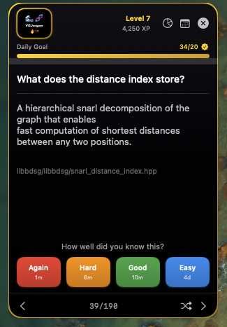

# vg-jargon

A flashcard system for learning [vg](https://github.com/vgteam/vg) (variation graph toolkit)
internals — interfaces, data structures, algorithms, and release changes. Cards are
authored as YAML, validated against a schema, and compiled into three outputs: a macOS
menu-bar widget, an Anki deck, and portable JSON.

Currently: **190 cards** across interfaces, data structures, algorithms, wiki concepts,
and per-release changelogs.

<p align="center">
  
</p>

## Prerequisites

- macOS 14+ with Xcode Command Line Tools (for the widget)
- Python 3
- [Docker Desktop](https://www.docker.com/products/docker-desktop/) — only needed if you want to update the deck via Aider
- [Ollama](https://ollama.com) — same, only needed for the Aider workflow

## Repo layout

```
vg-jargon/
├── content/                    # Source of truth — YAML flashcards
│   ├── schemas/card.schema.json
│   ├── interfaces/             # HandleGraph API cards
│   ├── data_structures/        # GBZ, distance index, etc.
│   ├── algorithms/             # Giraffe pipeline, etc.
│   └── releases/               # Per-release changelogs (drafted via Aider)
├── generators/                 # content/ → widget/cards.json, → Anki .apkg
├── scripts/
│   ├── extract_from_wiki.py            # vg.wiki → YAML
│   └── extract_from_release_notes.py   # GitHub releases → draft.md staging
├── widget/                     # macOS SwiftUI menu-bar app
└── tooling/aider-sandbox/      # Dockerfile + run.sh for sandboxed Aider+Ollama
```

Card schema and full authoring reference: [`CLAUDE.md`](CLAUDE.md).

## Quickstart

```bash
git clone git@github.com:kmertide/vg-jargon.git
cd vg-jargon
python3 generators/to_json.py     # regenerate widget/cards.json from content/*.yaml

# run the macOS widget
cd widget/VGJargon.swiftpm
swift run
```

`content/*.yaml` is the whole source of truth; everything else (`widget/cards.json`, the
Anki deck) is generated from it. The widget is a desktop-widget-style app — no Dock icon,
no Cmd+Tab entry, and it deliberately renders *behind* your other windows like a sticky
note. If you don't see it after launching, reveal your desktop (Mission Control / "Show
Desktop") rather than looking for a normal window.

## Updating the deck with Aider + Ollama

New vg releases get turned into cards through a semi-automated pipeline instead of manual
curation, running against a **local** model so no card content or data leaves your Mac:

1. `scripts/extract_from_release_notes.py` fetches new releases from the vgteam/vg GitHub
   API and stages each unprocessed one as `content/releases/<tag>.draft.md` (raw notes +
   a schema template). Idempotent — safe to re-run any time.
2. [Aider](https://aider.chat), running inside a locked-down sandbox (see
   [`tooling/aider-sandbox/`](tooling/aider-sandbox)) against Ollama, reads a staged draft
   and the card schema, and drafts `content/releases/<tag>.yaml`. The sandbox means the
   drafting model only ever sees this repo — and, read-only, the upstream `vgteam_repos/`
   clones if present — nothing else on your machine.
3. `python3 generators/to_json.py` regenerates `widget/cards.json`.

### One-time setup

```bash
# Ollama + a coding model
brew install --cask ollama   # or download from ollama.com
open -a Ollama
ollama pull qwen2.5-coder:32b   # ~19GB; use :14b on machines with <32GB RAM

# Ollama defaults to a 2k-token context window, which silently truncates long
# prompts. Fix that before drafting cards:
launchctl setenv OLLAMA_CONTEXT_LENGTH 8192
# quit Ollama from the menu bar, then:
open -a Ollama

# Build the sandbox image
cd tooling/aider-sandbox && docker build -t aider-sandbox . && cd ../..
```

### Drafting cards from a new release

```bash
python3 scripts/extract_from_release_notes.py
```
```
Staged content/releases/v1.77.0.draft.md
...
20 release(s) staged in content/releases/.
```

```bash
./tooling/aider-sandbox/run.sh
```

This drops you into Aider's normal interactive chat, scoped to this repo only. Example
prompt, used to draft the actual v1.77.0 cards in this repo:

```
Read content/releases/v1.77.0.draft.md and content/schemas/card.schema.json.
Also look at content/algorithms/giraffe_pipeline.yaml for the existing card
style. Create content/releases/v1.77.0.yaml with flashcards covering the
notable, user-facing changes — skip build/packaging boilerplate. Use deck:
vg-jargon::releases::v1.77.0, id prefix rel-, tags [release, v1.77.0].
```

That run produced 27 schema-valid cards covering deprecations (`vg mcmc`, `vg genotype`),
command changes (`vg call`, `vg snarls`, `vg deconstruct`, `vg gamsort`, `vg giraffe`
chaining), and one removal (`vg chain`). Then regenerate and commit:

```bash
python3 generators/to_json.py
git add -A && git commit -m "Add vg <tag> release cards"
```

## Trusting AI-drafted cards

Card drafting from structured release notes (well-scoped, mechanical) worked reliably.
Free-form doc editing (e.g. "fix these stale references in claude.md") was less reliable —
`qwen2.5-coder:32b` correctly identified some issues but also introduced a regression
(deleted valid content) and failed a `SEARCH/REPLACE` diff match against an ASCII-art
directory tree, silently dropping part of the requested fix.

**Review every Aider commit before trusting it.** The sandbox limits blast radius (scoped
filesystem access, no credentials, resource caps) — it does not guarantee correct output.
